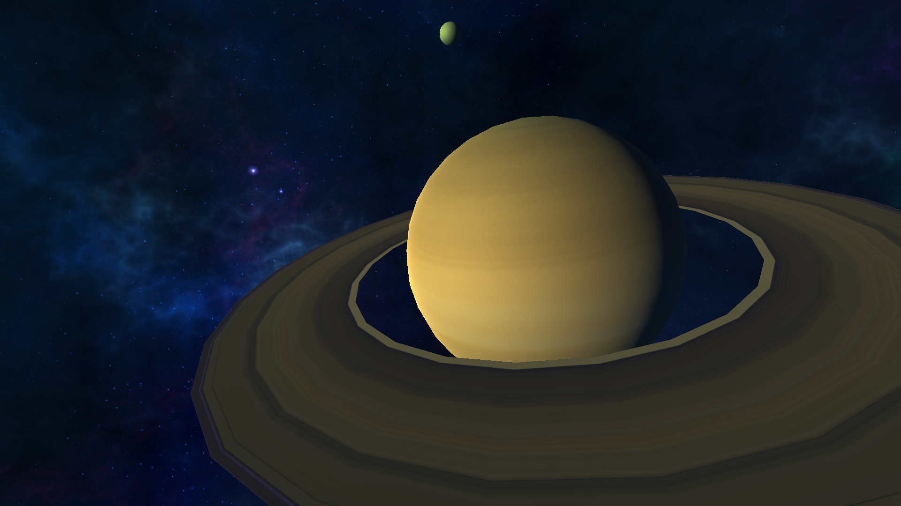

# Processamento Gráfico

Repositório para o Projeto Prático da disciplina de Processamento Gráfico

## Preview



## Cepheus

Cepheus é uma visualização do planeta saturno e uma das suas maiores luas Titan.

## Guia para execução do projeto

Para executar esse projeto, será necessário ter um servidor web.

Umas das formas para construir um servidor web, é usando python, para isso deve-se seguir as instruções abaixo.</br>
Dentro da pasta Example deve-se rodar o comando:
```bash
# Se a versão do Python for 3.X
python3 -m http.server

# Se a versão do Python for 2.X
python -m SimpleHTTPServer
```

Isso deverá criar um servidor web local que irá rodar na porta 8000 por padrão. 
Após rodar o servidor, para visualizar o projeto basta acessar o localhost na porta 8000 - [Cepheus](http://localhost:8000/)


Versões usadas durante desenvolvimento:
Programa/pacote | Versão
--------- | ------
Unity | 2020.3.20f1
Python | 3.10.0


## Decisões de Projeto

Os scripts foram desenvolvidos orientados a objeto, ou seja, cada objeto possui um ou mais scripts associados.

### Saturn

O Saturn.cs é reponsável por posicionar, escalonar e rotacionar o objeto Saturn na cena.

### Saturn Ring

O SaturnRing.cs é reponsável por criar os anéis de saturno de forma procedural. O script foi desenvolvido junto com um tutorial, com a intenção de adquirir 
conhecimentos sobre criação e renderização de objetos de forma procedural.

### Moon

O Moon.cs é reponsável por posicionar, escalonar e rotacionar o objeto Moon na cena.

## Movimento

## KeyMap

## Autores

- Guilherme Henrique Rodrigues  RA: 743544
- Rafael Jyo Kondo              RA: 743589
